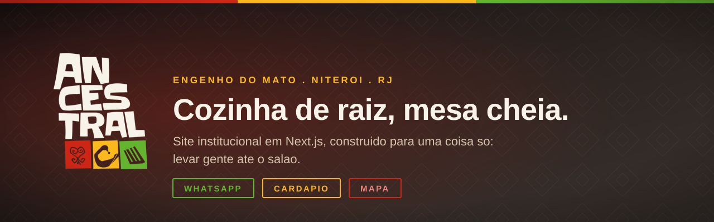
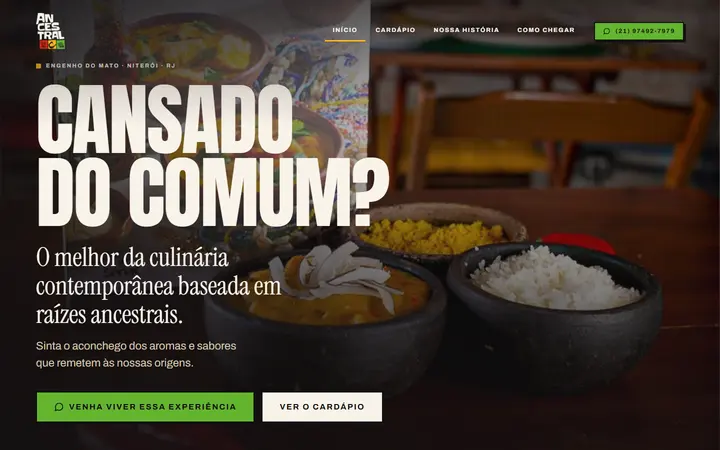
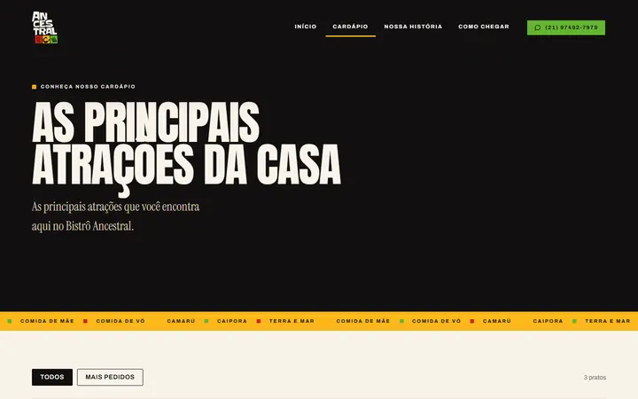
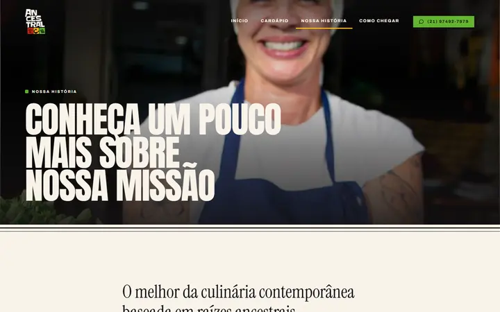
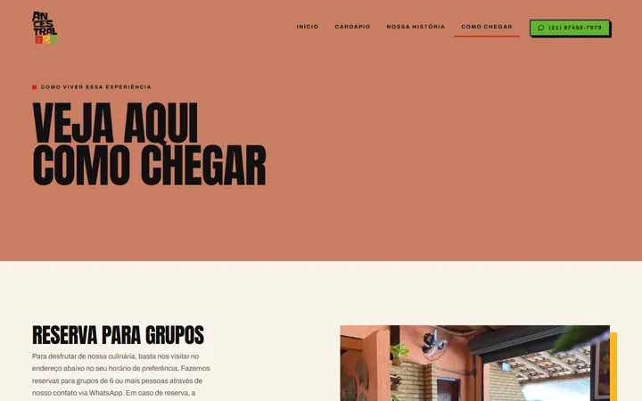
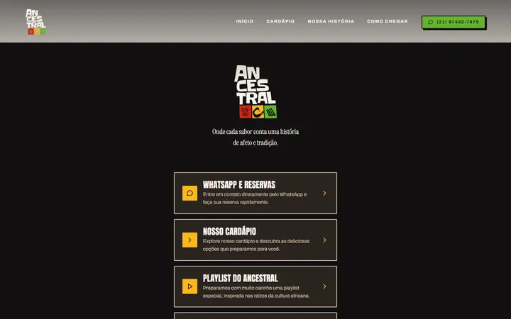
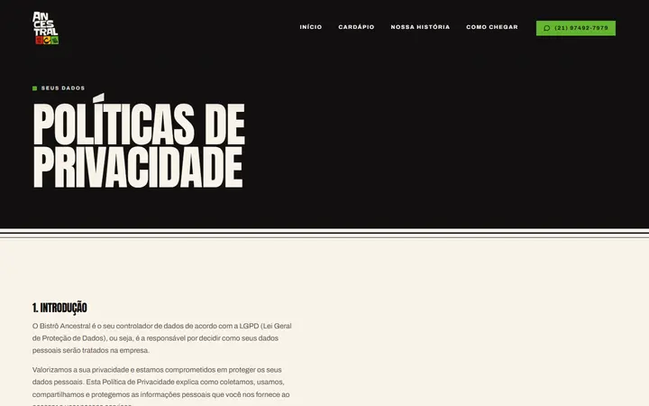
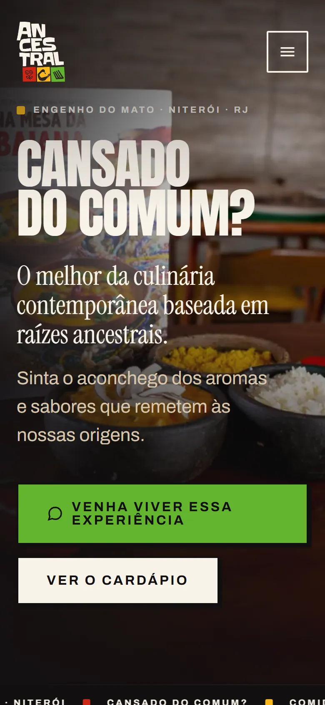
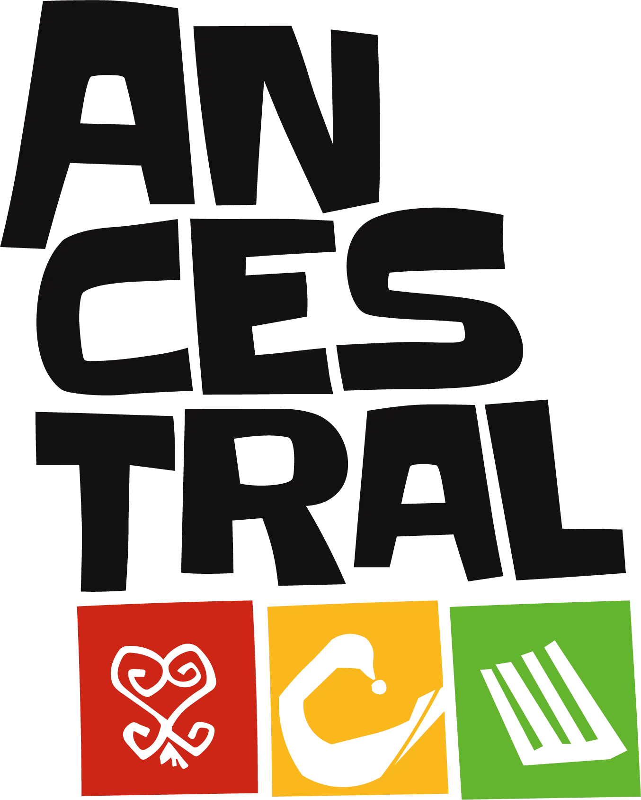

<div align="center">



Site institucional de um restaurante de culinária afro-brasileira em Niterói.
Migração de WordPress para Next.js, com um único objetivo de negócio: levar
gente à mesa do salão.

[](LICENSE)   

**[Ver o site](https://bistroancestral.com.br)** · [As telas](#as-telas) · [O que resolve](#o-que-o-projeto-resolve) · [Frontend](#frontend) · [Licença](#licença)

</div>

---

```
apps/
  frontend/   Next.js 16 (App Router) + TypeScript
docs/telas/   capturas usadas neste README
```

## O que o projeto resolve

O site anterior era WordPress com Elementor. Funcionava, mas cobrava caro por
isso: o cardápio e os horários viviam dentro do construtor visual, o conteúdo
saía de um tema que ninguém mais mantinha, e o carregamento carregava um
carrossel de 40 KB para exibir três fotos paradas.

O problema de negócio era outro, e mais simples: o restaurante depende de gente
entrando pela porta. Não há delivery, não há venda online. Cada visita começa
num clique que abre o WhatsApp, no mapa ou no telefone.

Este projeto reconstrói o site em torno disso. O conteúdo saiu do banco do
WordPress e virou dado tipado em `src/lib/`; a apresentação segue o sistema de
design da marca; e os caminhos que levam ao salão, WhatsApp, mapa, telefone,
cardápio, são medidos como conversão.

## As telas

<div align="center">

</div>

<table>
<tr>
<td width="50%"><a href="docs/telas/01-home.webp" title="ver a página inteira"></a><br><sub><b>Home</b> · hero fotográfico, cardápio, história e como chegar</sub></td>
<td width="50%"><a href="docs/telas/02-cardapio.webp" title="ver a página inteira"></a><br><sub><b>Cardápio</b> · os mais pedidos, numerados, com a foto sangrada</sub></td>
</tr>
<tr>
<td width="50%"><a href="docs/telas/03-historia.webp" title="ver a página inteira"></a><br><sub><b>Nossa história</b> · depoimentos em vídeo de quem cozinha</sub></td>
<td width="50%"><a href="docs/telas/04-como-chegar.webp" title="ver a página inteira"></a><br><sub><b>Como chegar</b> · endereço, horário e reserva pelo WhatsApp</sub></td>
</tr>
<tr>
<td width="50%"><a href="docs/telas/05-links.webp" title="ver a página inteira"></a><br><sub><b>BistroLinks</b> · a página da bio do Instagram, sem navegação</sub></td>
<td width="50%"><a href="docs/telas/06-politica.webp" title="ver a página inteira"></a><br><sub><b>Privacidade</b> · a política de LGPD transcrita do site anterior</sub></td>
</tr>
</table>

### No celular

O mesmo conteúdo em uma coluna. O primeiro botão de WhatsApp aparece dentro da
primeira rolagem.

<div align="center">
<a href="docs/telas/07-mobile-card.webp" title="ver a página inteira"></a>
</div>

---

## Frontend

Next.js com App Router. As seis rotas são geradas no build, não há banco nem
API: o conteúdo é dado tipado, e mudar um prato é editar um arquivo.

Decisões que sustentam o objetivo:

* **Server Components por padrão.** Só vão para o cliente os componentes que
  precisam de estado: navegação, accordion, contador, player e os avisos.
* **`next/font`** auto-hospeda Anton, Archivo e Instrument Serif no build, sem requisição a terceiro e sem salto de layout na troca de fonte.
* **Player de vídeo sob demanda.** O embed do YouTube só é montado no clique.
  Carregado junto com a página, ele registra cookie de terceiro e é o recurso
  mais pesado do site.
* **Ícones SVG desenhados no projeto**, em vez de biblioteca por CDN.
* **Consentimento de verdade.** O GTM só carrega depois do aceite de cookies, no site anterior ele subia antes de qualquer clique.
* `sitemap.xml`, `robots.txt`, canonical, Open Graph e JSON-LD `Restaurant`
  com coordenadas, horário e cardápio.

```bash
cd apps/frontend
npm install
cp .env.example .env.local     # ajuste NEXT_PUBLIC_SITE_URL e o ID do GTM
npm run dev                    # http://localhost:3000
npm run build && npm start     # produção
npm run lighthouse             # audita as seis rotas, mobile e desktop
```

### Onde mexer

| O que | Arquivo |
| --- | --- |
| Endereço, horário, telefone, links externos | `src/lib/restaurante.ts` |
| Cardápio, serviços, FAQ, textos das seções | `src/lib/conteudo.ts` |
| Rotas da navegação | `src/lib/rotas.ts` |
| Cores, tipografia, espaçamento, motion | `src/styles/tokens/` |
| Componentes do sistema de design | `src/components/ds/` |
| Montagem de cada tela | `src/views/` |

O conteúdo editorial fica separado dos dados duros de propósito: a cozinha
revisa `conteudo.ts` com frequência, enquanto endereço e horário quase não
mudam e alimentam também o JSON-LD.

### Medição

Os cliques que levam ao salão disparam eventos no `dataLayer`:

| Evento | Onde |
| --- | --- |
| `clique_whatsapp` | CTAs de reserva e contato |
| `clique_telefone` | telefone do cabeçalho e do rodapé |
| `clique_mapa` | "Ver endereço no mapa" |
| `clique_cardapio` | cardápio completo |

Quem recusa cookies não é medido, a contagem fica abaixo do número real de
cliques. É o custo de o consentimento valer de fato.

---

## Acessibilidade e performance

As seis rotas fecham **100 em acessibilidade, boas práticas e SEO**, no perfil
móvel e no desktop. Desempenho fica entre 95 e 100.

Algumas decisões vieram de medição, não de gosto:

* O laranja da marca com texto branco dá 2,14:1. O tom da ação foi escurecido
  até passar o mínimo da WCAG, mantendo o vivo onde o fundo é escuro.
* As animações de entrada nunca escondem conteúdo: o bloco nasce na posição
  final e só desliza quando entra em tela. Se o JavaScript falhar, a página
  continua legível.
* `prefers-reduced-motion` desliga todo o movimento, inclusive o marquee.

---

## Licença

© 2026 NerdResolve. Todos os direitos reservados.

O repositório é público para avaliação técnica e demonstração de portfólio. O
código pode ser lido e estudado; não há licença de uso, cópia ou
redistribuição. Ver [LICENSE](LICENSE).

A marca, as fotografias, os textos e o sistema de design do Bistrô Ancestral
pertencem ao titular e não são licenciados por este repositório.

<div align="center">

</div>
